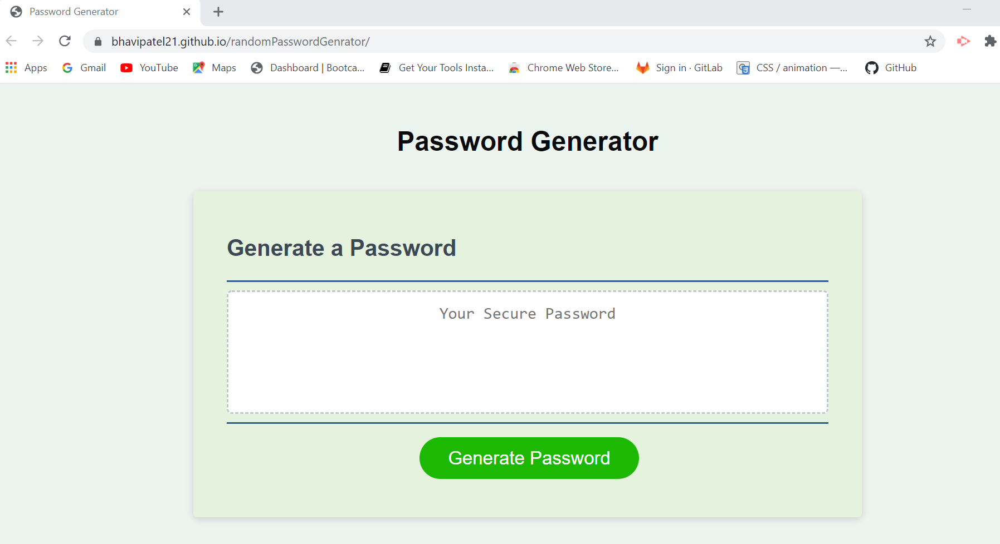
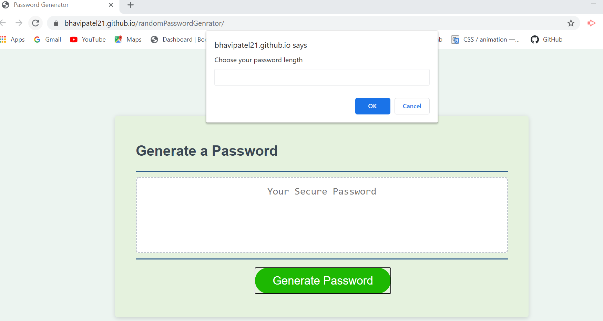

#  Project Title 
 Random Password Generator

## Description 

As a developer i should build an application which allows an end user to create a random password by clicking a button and selecting  character type options

## User Story
```
AS AN employee with access to sensitive data
I WANT to randomly generate a password that meets certain criteria
SO THAT I can create a strong password that provides greater security

```
## Acceptance Criteria 
* User should be able to open the webpage without any issues/errors
* User should be able to click the button to generate a password
* User should be presented with prompts for password length of at least 8 characters and no more than 128 characters
* User should be presented with prompts for character types to include in the password
* User should be able choose lowecase, uppercase, numeric, and/or special characters
* User must choose atleaset one character type 
* User should be able to see the password generated based on the criteria they selected

## Web Url :

url : https://bhavipatel21.github.io/generateRandomPassword/

## Mock-Up



* click on Generate Password Button to create password :


## PSEUDOCODE

     1. click button to generate a password
        A. prompt for password criteria
            -select criteria for password
              -prompt for length- at least 8 characters and no more than 128 characters
              
              -prompt for character types
                -lowercase
                -uppercasea
                -numeric
                -special characters
              -check to make sure one character type is used


        B. generate password (using selected criteria!)
          -alert or write it to the page

 

## Test Cases

* Verify user can open the webpage without any issues/errors
* Verify user can click on grenerate a password button
* Verify user is presented with a prompt to enter required password length 
* Verify user cannot enter invalid input for password length
* Verify user cannot enter less than 8 and more than 128 for password length
* Verify user can see the prompt for character types once they have choosen valid password length
* Verify if user do not select any character type, they are presented with an aleat to must choose one character type
* Verify password is generated with users selected charcter types
* Verify password is displayed for user 
